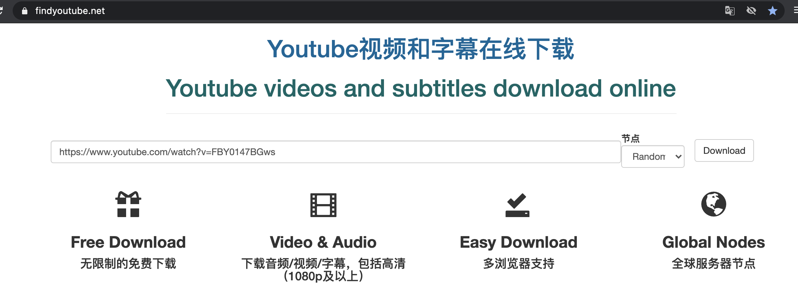
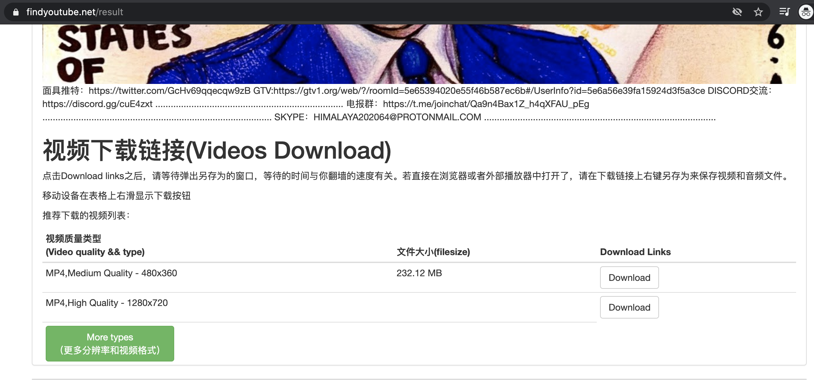
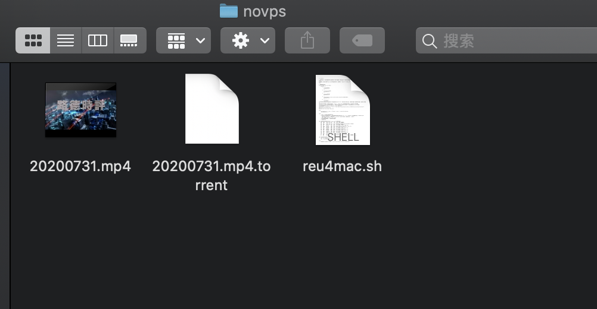

# 回看油管视频通过P2P传播爆料革命  
大部分 VPS 架设 P2P 都会被封号，想破脑袋，终于找到了不用申请 VPS 传播爆料革命的方法。  

本项目适合传播任何分辨率的音视频，只要油管支持的格式就可以向墙内传播。  
  
**任何战友都可以自愿参与此项目，  
人数越多向墙内传播的速度越快**。  

## 项目简介  
战友通过此方法回看爆料革命油管音视频，同时给墙内用 Bittorrent 下载的战友补档(给种子加速)，用此脚本回看同一音视频的战友越多，墙内战友下载越快。  

## 版权声明：
本项目为穿墙模式试探，所有方法与技术实现不向爆料革命战友保留版权，任何爆料革命战友都可以用相同的方式传播爆料革命。  
如爆料革命主播想用此方式向墙内传播音视频，本人可以提供全程技术支持，请在评论区留言，我会主动联系爆料革命主播本人。  

## 穿墙原理：
通过解析 youtube 音视频链接，发现非 Blob 链接，用 aria2 技术下载后，用 mktorrent 生成 .torrent 种子文件，用 "aria2c -S" 命令解析 magnet 链接。  

墙外战友在下载时可以通过 BT 向墙内分享流量，墙外战友下载人数越多，墙内速度越快。墙内战友可直接下载 .torrent 种子。而 magnet 首先会自动下载种子，某些 BT 软件在下载 magnet 链接时找种慢，可以用迅雷(虽然有点危险)下载 magnet，这样找种快，然后再用其它 BT 软件下载此种子文件， *注意* ，迅雷在指定下载文件夹内先下载种子，但种子是隐藏文件，要想看到种子需要打开文件夹的显示隐藏功能。  

墙内外战友都需要设置连接到 tracker 或 DHT，GFW 是无法完全封锁 Bittorrent 软件的 tracker 服务器和 DHT 路由。  

## 软件安装  
所有参与分享流量的战友需要安装  
### MAC操作系统
- 安装 homebrew：  
```
/usr/bin/ruby -e "$(curl -fsSL https://raw.githubusercontent.com/Homebrew/install/master/install)"  
```
- 安装 aria2：  
```
brew install aria2  
```
[设置](setaria2.md) aria2 解决无法下载磁力链接、BT种子和速度慢的问题  
- 安装 mktorrent：  
```
brew insatll mktorrent
```  

### WIN操作系统  
- 安装 mktorrent：  
进入[网站](https://github.com/q3aql/mktorrent-win)，根据你操作系统是32位或64位，直接下载 .7z 软件压缩包，解压到某个目录。  
- 安装 aria2：  
进入[网站](https://github.com/aria2/aria2/releases/tag/release-1.35.0)，根据你操作系统是32位或64位，直接下载 .zip 软件压缩包，解压到某个目录。  
- 设置运行环境：  
将以上两个软件路径添加 PATH 参考此网站根据你的操作系统版本[设置PATH](https://www.java.com/zh_CN/download/help/path.xml)  

### LINUX操作系统
- 会 linux 的战友，一定能看懂 MAC 脚本，不写了，基本一样，无非是换几个命令。  

## 实施步骤  
以面具先生20200731视频为例：  
### 手动方案  
1. 访问面具先生视频，复制网址  
https://www.youtube.com/watch?v=FBY0147BGws  
2. 访问 youtube 视频链接解析网站，将面具网址粘贴到文本框内  
https://www.findyoutube.net/  
  
3. 点击文本框后的 download 按钮进入下一页面  
4. 向下滚动，会看到“视频下载链接(Videos Download)”，根据油管提供的视频清晰度，本网站会提供不同的下载链接，直接结束后大概1小后，油管才会生成下载链接。  
  
5. 右键点击任意 Download 按钮，复制链接地址。  
6. 打开 MAC 终端，输入以下命令开始下载  
```
aria2c --all-proxy "http://127.0.0.1:1087" "此处粘贴刚才复制的链接地址"  
```
因我用翻墙软件 v2rayU 所以需要代理，不翻墙的可去掉` --all-proxy "http://127.0.0.1:1087"`  
其它翻墙软件根据自己的代理修改引号里的内容。  
下载后文件名为 "videoplayback"，无后缀，改名为"20200731_mask.mp4"。
7. 生成 .torrent 种子  
```
mktorrent -o 20200731_mask.mp4.torrent 20200731_mask.mp4  
```
在本文件内会出现 20200731_mask.mp4.torrent 种子文件  
8. 生成 .magnet 文件  
```
aria2c -S 20200731_mask.mp4.torrent | awk '/Magnet URI:/{gsub("Magnet URI: ","");print}') | > 20200731_mask.mp4.magnet  
```
9. 将 .torrent / .magnet 两种文件上传到某个空间或分享到群。

## 脚本用法  
[下载视频生成种子MAC脚本](reu4mac.sh)  
此脚本基本是上边 9 个步骤的一键脚本，打开脚本查看注释，或执行命令 ./reu4mac.sh -h 查看帮助  

本脚本帮助战友回看爆料革命油管音视频，同时给墙内用 Bittorrent 下载的战友补档(给种子加速)，用此脚本下载或回看同一音视频的战友越多，墙内战友下载越快。  
本脚本首先会下载音视频，下载后会生成同名的 .torrent / .magnet 文件，如果你想传播此音视频，可以将这两个文件传向墙内。  
补档：Bittorrent 种子下载时通常下载速度为 0，这是因为种子是死档。而将种子内文件放入 BT 软件内就是补档，给 BT 种子加速。  
本脚本使用前需要安装 homebrew / mktorrent / aria2，安装命令如下：  
安装 homebrew：`/usr/bin/ruby -e "\$(curl -fsSL https://raw.githubusercontent.com/Homebrew/install/master/install)"`  
安装 aria2：`brew install aria2`  
安装 mktorrent：`brew insatll mktorrent`  

语法 :  
    `./mkfromUtube.sh -f code -o filename -x proxy -i videoLinkfromYoutube`  
    `./mkfromUtube.sh -h`  
**注：**  
其它操作系统脚本 reu4win.bat(WIN) / reu4linux.sh(linux) 请耐心等待。  

## 项目参考  
[路德油管视频分享](https://github.com/baoliaogeming2020/lude) / [面具油管视频分享](https://github.com/baoliaogeming2020/mask)  

## 参与分享  
- 参与分享链接：根据本项目步骤或脚本生成 .torrent / .magnet 下载链接，向墙内分享 .torrent / .magnet  
- 参与分享流量：根据本项目步骤或脚本下载，并保留下载内容一段时间，保持开机状态，这样可以向墙内战友分享P2P流量

## 软件支撑   
墙内战友可用的，支持 .torrent / .magnet 协议的软件，需要对软件进行相应的设置。  
### 支持 metalink 软件汇总：  
- aria2：是一款自由、跨平台命令行下载管理器，支持的下载协议有： HTTP / HTTPS / FTP / Bittorrent / Metalink。无 shell 基础战友不建议使用。  
- AriaNg：  
- aria2webui：  
- yaaw：  
... ...  

### 支持 BT / magnet 软件汇总：
- Motrix：https://motrix.app/  
... ...  

### BT服务器：
- tracker 服务器网站：https://newtrackon.com/list  
- dht.dat 下载的网站：https://github.com/P3TERX/aria2.conf  
